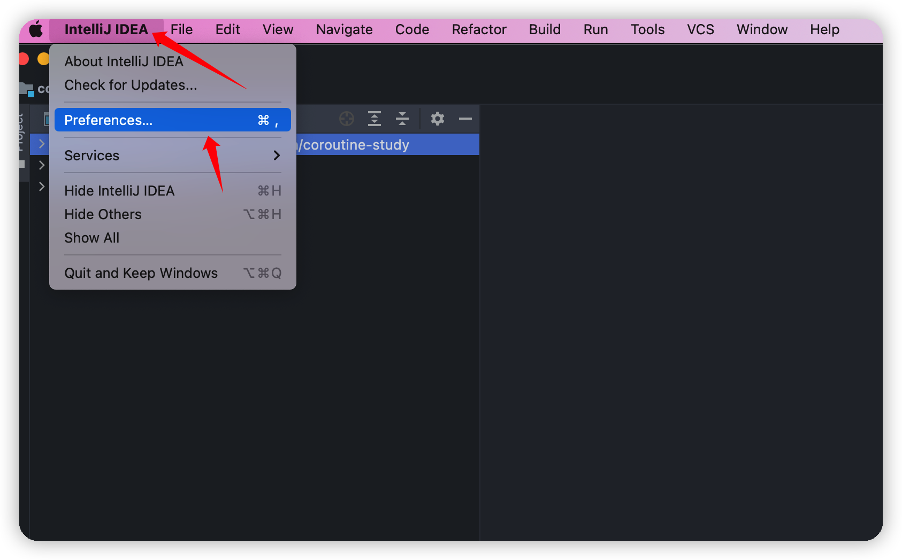
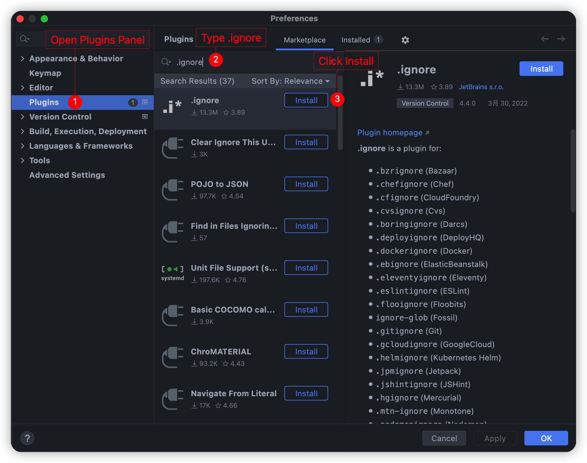
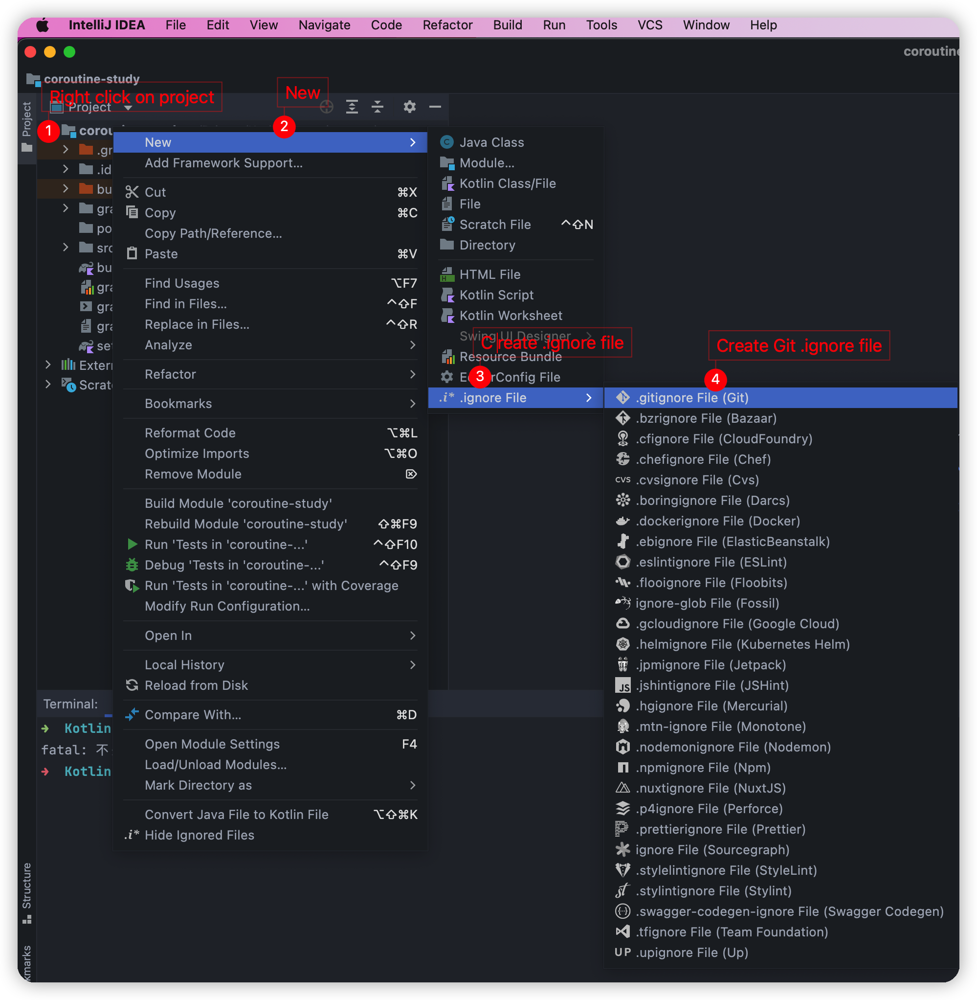
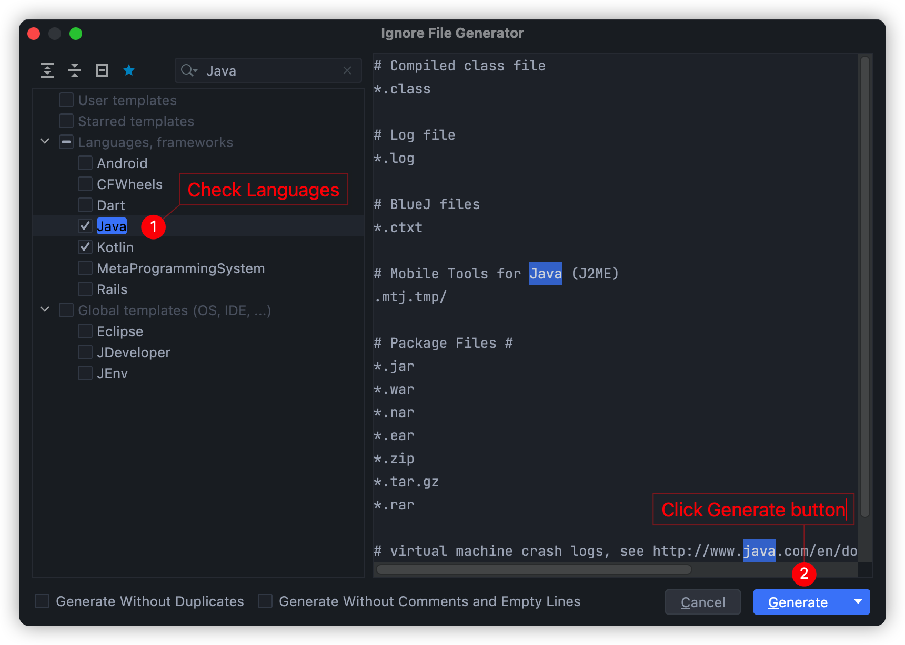
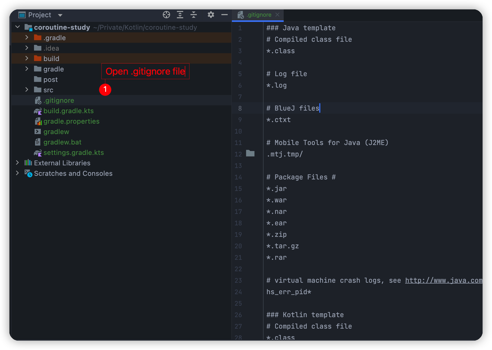
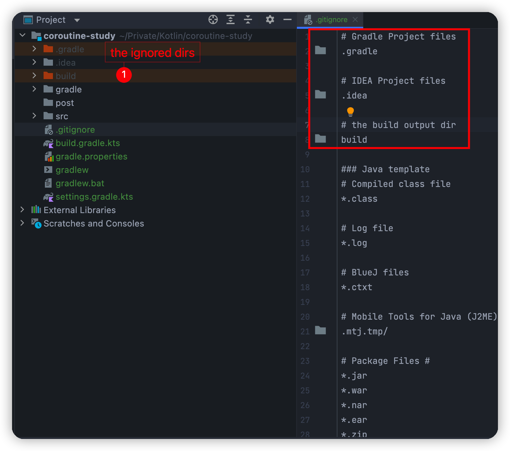
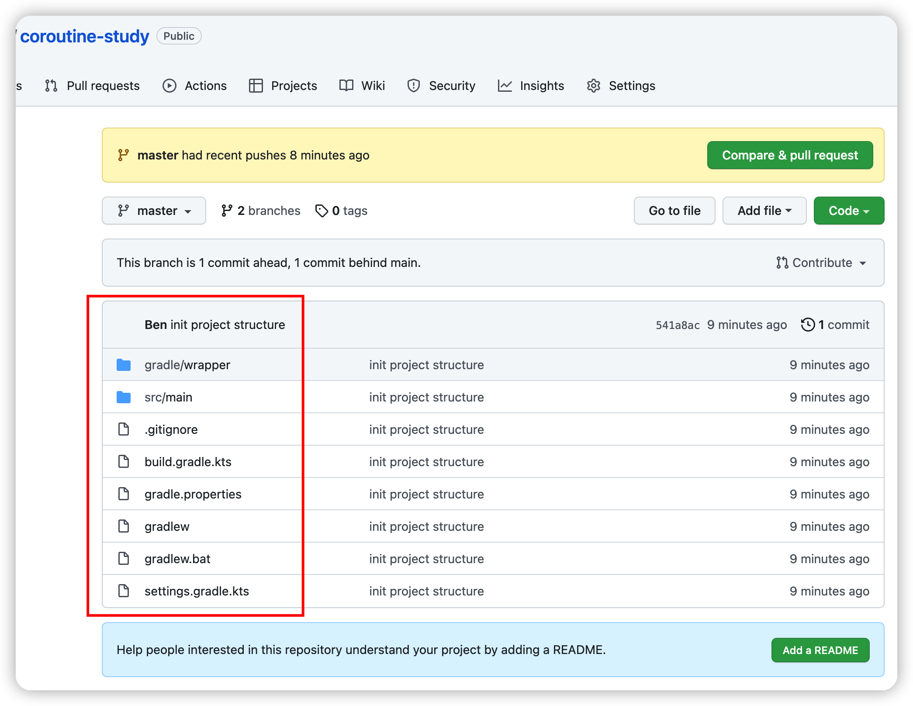

## 1. Plug-in introduction

When using git, you often encounter some files that you don't want to submit (such as the `.idea` folder and its contents automatically generated by IDEA). At this time, you need to use the `.gitignore` file.

`.gitignore` does not need to be written completely from scratch, it can be automatically generated using the .ignore plugin.

Plugin Home Page: https://plugins.jetbrains.com/plugin/7495--ignore

## 2. Installation method

The first step: **IntelliJ IDEA -> Preferences...**

Step 2: Download and install the **.ignore** plugin

Step 3: After the installation is successful, restart IDEA

## 3. How to use

After restarting, start using the .ignore plugin.

Step 1: Create the `.ignore` file

Step 2: Check the template and generate the file

Step 3: Open the .gitignore file as follows:

Step 4: Configure the files and folders to ignore.

Step 5: Upload to GitHub to view the results.

It was found that files in `.gradle\.idea\build` directories were ignored and not uploaded.

