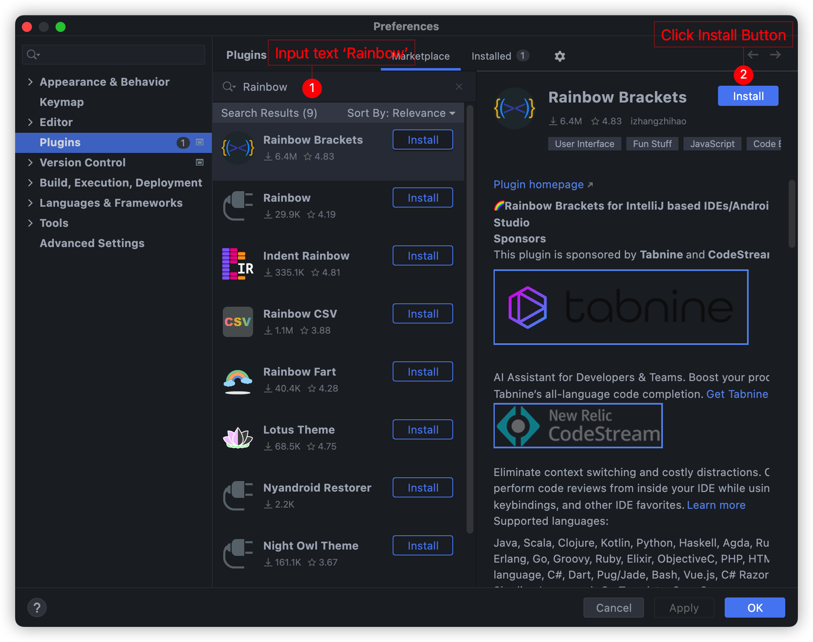
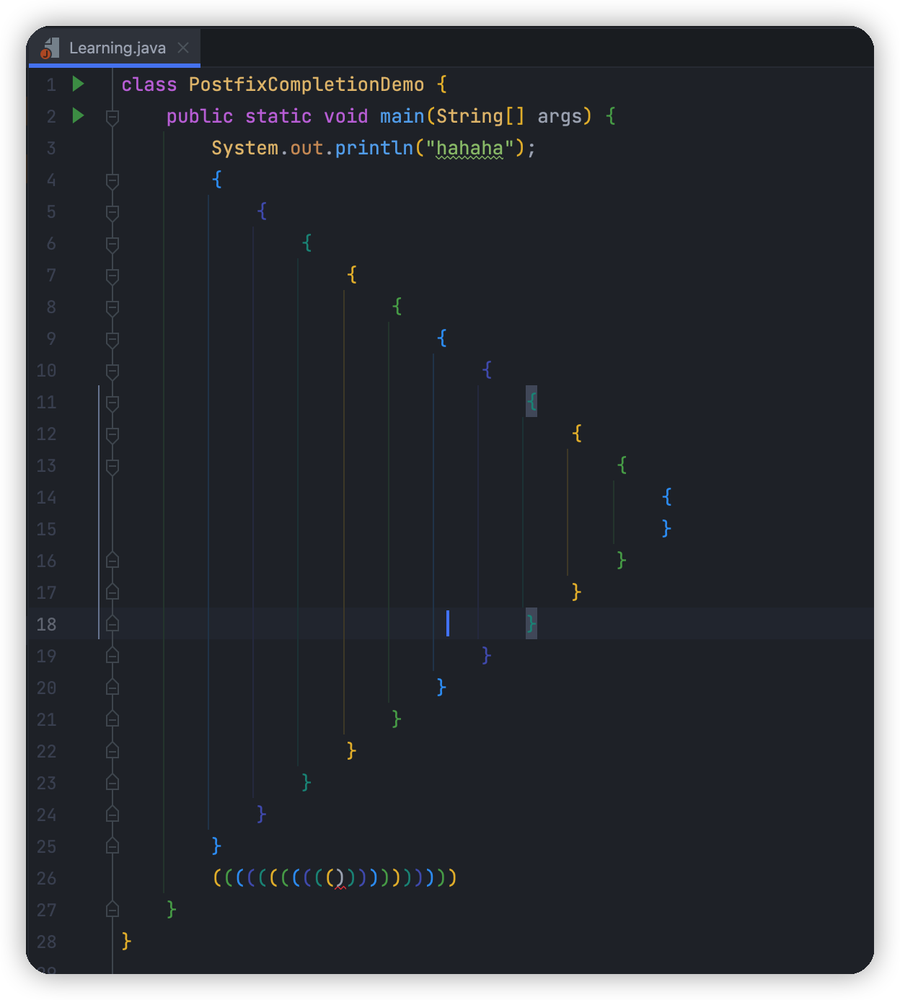
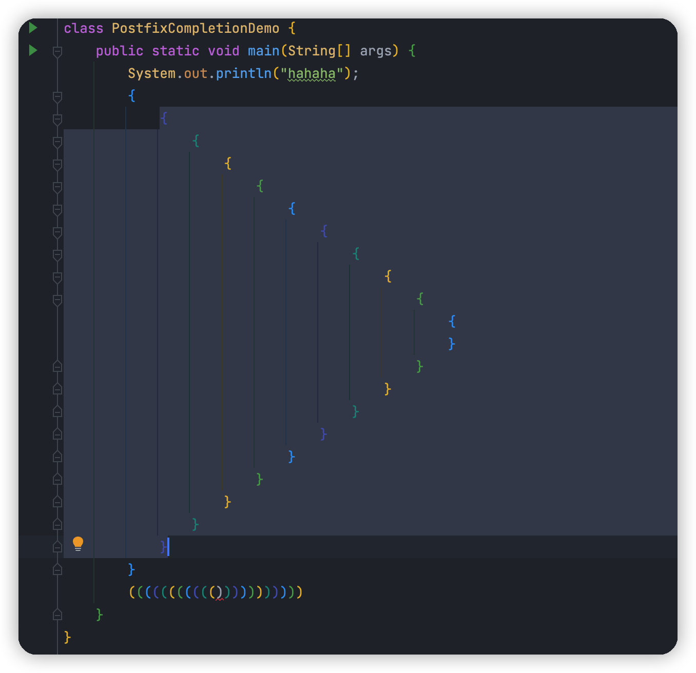

## 1. Plug-in introduction

🌈Rainbow Brackets for IntelliJ based IDEs/Android Studio/HUAWEI DevEco Studio

The same color of paired brackets can be realized, and the function of highlighting the code of the selected area can be realized.

- Plugin Home Page: https://plugins.jetbrains.com/plugin/10080-rainbow-brackets
- Source Code: https://github.com/izhangzhihao/intellij-rainbow-brackets

## 2. Installation method

Use IDEA to search for plugin installations:

## 3. How to use

It will be used naturally after the installation is successful.

Scope highlighting

